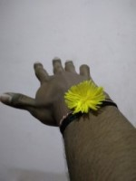

# Wrist Image Dataset   

This dataset consists of images of wrist (with different kind of bands on it).

**Introduction**    
Dataset consists of images of wrist captured using mobile phones in real-world scenario. Images were captured under wide variety of lighting conditions, weather, indoor and outdoor. This dataset can be used for Augmented Reality, Mixed Reality, Rakhi Detection, Wrist-watch Detection, Hand-band Detection, etc.    

**Dataset Features**  
* Captured by 3000+ unique users  
* Rich in diversity 
* Mobile phone view point  
* Various items on the wrist  
* Consists male and female wrists
* HD Resolution  
* Various lighting conditions  
* Indoor and Outdoor scene   

**Dataset Format**  
* Classification and detection annotations available   
* COCO, PASCAL VOC and YOLO formats  
* Approx. 6000 unique images  

**Sample Images**  
         

  
    

# Datacluster Labs Datasets

Datacluster Labs focuses on Crowd Data Collection through our managed crowd-sourcing platform - [Dailydata](https://play.google.com/store/apps/details?id=com.daily.data). 

We provide integrated services for your AI needs:  
* Data Collection  
* Data Curation  
* Data Annotation 

We deal with all types of multimedia data collection and annotation like images, videos, audio, text and surveys.

**To download full datasets or to submit a request for your dataset needs, please contact **sales@datacluster.ai****  

To download the full datasets, please contact [sales@datacluster.ai](sales@datacluster.ai).  
Visit [www.datacluster.in](www.datacluster.in) to know more.
    

**Note:**  
**All the images are manually verified and are contributed by the large contributor base on our platform.** 
